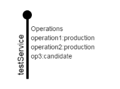

Interface Subclass
=================

This creates a standard diagram of a SOA interface. It displays the SOA service; When you click on the service, it also displays the
operations associated with the service and any context (e.g. whether they are live etc.).

Here is a screen-shot of an example service

The JSON document to create this test service is:

'''
{
  "objects": [
    {
      "type": "interface",
      "name": "testService",
      "width": 40,
      "height": 150,
      "left": 100,
      "top": 100,
      "operations": [
        {
          "name": "operation1",
          "status": "production"
        },
        {
          "name": "operation2",
          "status": "production"
        },
        {
          "name": "op3",
          "status": "candidate"
        }
      ]
    }
  ],
  "background": ""
}
'''

