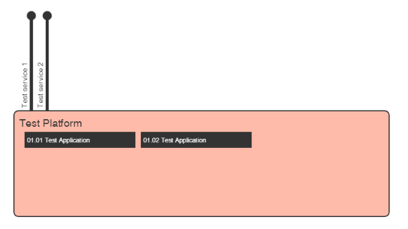

Platform Subclass
=================

This creates a standard diagram if a platform, with North-bound SOA interfaces and encapsulating a number of applicaitons. The generated output looks like:




The JSON document to create this test platform is:

```
{
  "objects": [
    {
      "type": "platform",
      "name": "Test Platform",
      "northboundInterfaces": [
        {
          "name": "Test service 1",
          "operations": [
            {
              "name": "Get Test Operation",
              "status": "Candidate"
            },
            {
              "name": "Set Test Operation",
              "status": "Production"
            }
          ]
        },
        {
          "name": "Test service 2",
          "operations": [
            {
              "name": "Get Test Operation",
              "status": "Candidate"
            },
            {
              "name": "Set Test Operation",
              "status": "Production"
            }
          ]
        }
      ],
      "cobraApplications": [
        {
          "name": "01.01 Test Application"
        },
        {
          "name": "01.02 Test Application"
        }
      ]
    }
  ],
  "background": ""
}
```

